# QuestForge — Fantasy Adventure Guild Platform


## Overview

**QuestForge** is a full-stack Flask application for managing a fictional fantasy adventure guild. It combines a public weekly quest board with authentication, role-aware navigation, party-capacity management, scheduling rules, participation deadlines, and administrative statistics.

The project presents playful fantasy content through the structure of a practical reservation platform. Its core focus is reliable server-side validation, readable modular Python, relational SQLite data, and a polished responsive interface.

## Concept

The QuestForge guild publishes adventure sessions across one simulated Monday-to-Sunday week. Visitors can inspect the board, while registered Adventurers can reserve party places as a Warrior, Mage, or Healer.

A Guild Master creates quests and schedules their sessions. The Guild Council Admin receives a read-only overview of accounts, activities, reservations, and popularity trends.

The application uses a simulated current time rather than the system calendar:

```text
Current day:  Wednesday
Current time: 10:00
```

This fixed clock makes participation deadlines and past/future session behavior predictable during demonstrations.

## Main Features

- Public weekly quest board ordered from Monday through Sunday
- Filters for day, quest type, difficulty, and available party role
- Detailed quest-session pages with live remaining capacity
- Adventurer and Guild Master registration
- Flask-Login authentication with role-specific redirects
- One- or two-place party reservations
- Warrior, Mage, and Healer capacity enforcement
- Duplicate, weekly-limit, and schedule-overlap prevention
- Simulated eight-hour edit and cancellation deadline
- Guild Master quest creation and session scheduling
- Location conflict detection using complete session durations
- Guild Master capacity and reservation summaries
- Read-only Guild Council Admin dashboard
- Dark fantasy responsive design built with Bootstrap and custom CSS

## User Roles

| Role | Access |
|---|---|
| Visitor | Browse and filter the quest board, then view session details |
| Adventurer | Join sessions and manage owned participations |
| Guild Master | Create quests, schedule sessions, and manage empty sessions |
| Guild Council Admin | Review users, quests, sessions, reservations, and statistics |

Public registration allows the `Adventurer` and `GuildMaster` roles. Admin accounts are not available through the registration form and are created through seeded application data.

## Quest Sessions

A quest stores the reusable adventure information:

- Title
- Quest type
- Difficulty
- Duration in minutes
- Description
- Optional image filename

A quest session schedules that quest with:

- Day of the week
- Start time
- Guild location

Session ordering and overlap checks use a Monday-to-Sunday day index and the quest's duration. Back-to-back sessions are allowed because time comparisons use half-open intervals.

Supported quest types are Combat, Exploration, Puzzle, Stealth, Magic, and Survival. Difficulty levels are Easy, Medium, Hard, and Legendary.

## Party Role System

Each session has independent capacity for three party roles:

| Party role | Capacity per session |
|---|---:|
| Warrior | 4 places |
| Mage | 3 places |
| Healer | 2 places |

An Adventurer reserves either one or two places. A two-place participation assigns both places to the same selected role. Remaining capacity is calculated from the sum of `places_reserved`, rather than the number of participation records.

SQLite triggers provide an additional database-level guard against role overbooking.

## Business Rules

### Adventurer participation

- Only authenticated Adventurers can join sessions.
- A role must be Warrior, Mage, or Healer.
- A participation reserves exactly one or two places.
- An Adventurer cannot join the same session twice.
- An Adventurer can hold at most three participations in the simulated week.
- An Adventurer cannot join overlapping sessions on the same day.
- Capacity is checked before insert and update.
- Only the participation owner can edit or cancel it.
- Editing and cancellation are allowed only when the session is strictly more than eight hours away.
- Exactly eight hours before a session is already locked.

### Guild Master scheduling

- Quest type, difficulty, duration, and required text fields are validated server-side.
- Session day, time, location, and quest ID must be valid.
- One location cannot host overlapping sessions on the same day.
- An existing session is excluded from its own overlap check while being edited.
- Sessions with participations cannot be edited or cancelled.
- Cancelling an empty session removes it from the weekly schedule.

### Administration

- The Admin dashboard is read-only.
- Admin accounts cannot join sessions, create quests, or modify participations.
- Popularity calculations use reserved places, so a two-place reservation contributes two.

## Technology Stack

| Area | Technology |
|---|---|
| Backend | Python, Flask |
| Authentication | Flask-Login |
| Password security | Werkzeug password hashing |
| Database | SQLite through Python's standard `sqlite3` module |
| Templates | Jinja |
| Frontend | HTML5, CSS3 |
| UI framework | Bootstrap 5 CDN |
| Styling | Custom responsive dark-fantasy CSS |

The project intentionally does not use SQLAlchemy or Flask-WTF.

## Project Structure

```text
questforge-adventure-guild/
├── app.py
├── auth.py
├── database.py
├── models.py
├── quests.py
├── participations.py
├── guild_master.py
├── admin.py
├── helpers.py
├── requirements.txt
├── README.md
├── static/
│   ├── css/
│   │   └── style.css
│   └── images/
└── templates/
    ├── base.html
    ├── home.html
    ├── login.html
    ├── register.html
    ├── quest_detail.html
    ├── join_session.html
    ├── adventurer_profile.html
    ├── guild_master_dashboard.html
    ├── create_quest.html
    ├── schedule_session.html
    ├── edit_session.html
    └── admin_dashboard.html
```

The SQLite database file (`database.db`) is generated locally on first run and is intentionally not committed. Sample data and demo accounts are created automatically by the application.

## Core Modules

### `app.py`

Creates the Flask application, initializes Flask-Login and SQLite, and registers the public, authentication, Adventurer, Guild Master, and Admin routes.

### `auth.py`

Handles registration, login, logout, password verification, role redirects, and the reusable `require_role` access decorator.

### `database.py`

Creates the SQLite schema, enables foreign keys, defines role-capacity triggers, seeds demo records, and provides user lookup and connection helpers.

### `models.py`

Contains the Flask-Login-compatible `User` wrapper.

### `quests.py`

Loads the public board, validates filters, calculates board availability, and renders individual session details.

### `participations.py`

Implements Adventurer join, edit, cancellation, ownership, capacity, weekly-limit, overlap, and deadline behavior.

### `guild_master.py`

Implements the Guild Master dashboard, quest creation, session scheduling, location conflict checks, session editing, and cancellation.

### `admin.py`

Builds read-only user, session, role-capacity, summary, and popularity statistics for the Guild Council dashboard.

### `helpers.py`

Centralizes simulated time, allowed values, day ordering, time conversion, interval overlap, capacity calculations, and modification-deadline helpers.

## Database Overview

QuestForge uses four main tables:

| Table | Purpose |
|---|---|
| `users` | Stores account names, unique emails, password hashes, and roles |
| `quests` | Stores reusable quest descriptions and classifications |
| `quest_sessions` | Schedules quests by day, time, and location |
| `participations` | Links Adventurers to sessions with a role and place count |

Relationships:

```text
quests 1 ──── * quest_sessions
users  1 ──── * participations
quest_sessions 1 ──── * participations
```

SQLite constraints validate allowed account roles, quest types, difficulty levels, days, locations, role categories, and place counts. A unique constraint prevents the same user from joining one session more than once.

## How to Run Locally

### 1. Open the project directory

```powershell
cd questforge-adventure-guild
```

### 2. Create a virtual environment

```powershell
python -m venv .venv
```

### 3. Activate it

Windows PowerShell:

```powershell
.\.venv\Scripts\Activate.ps1
```

macOS or Linux:

```bash
source .venv/bin/activate
```

### 4. Install dependencies

```bash
pip install -r requirements.txt
```

### 5. Start the application

```bash
python app.py
```

Open `http://127.0.0.1:5000` in a browser. The schema and sample data initialize automatically when the database is empty.

For local debugging, set `FLASK_DEBUG=1`. Set a strong `SECRET_KEY` environment variable before using the application outside local development.

## Sample Accounts

All seeded accounts use the password `password123`.

| Role | Name | Email | Password |
|---|---|---|---|
| Adventurer | Aria Stormwind | `aria@questforge.example` | `password123` |
| Adventurer | Borin Ironshield | `borin@questforge.example` | `password123` |
| Adventurer | Lyra Moonspell | `lyra@questforge.example` | `password123` |
| Guild Master | Eldrin Oakwarden | `guildmaster@questforge.example` | `password123` |
| Guild Council Admin | Celeste Starseer | `admin@questforge.example` | `password123` |

These credentials are demonstration data and must not be reused in a production environment.

## Screenshots

### Homepage


### Weekly Quest Board

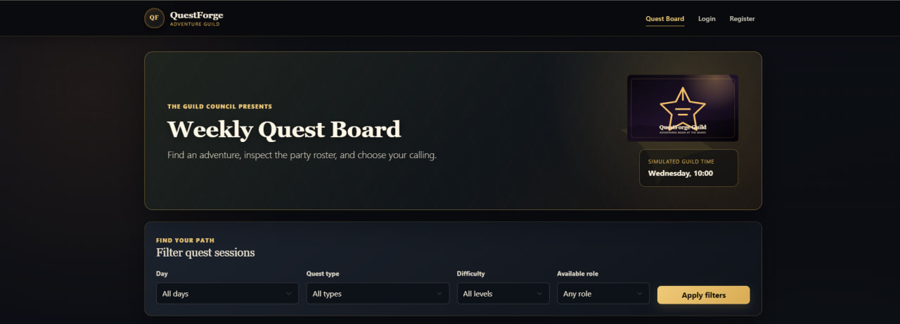

### Available Sessions

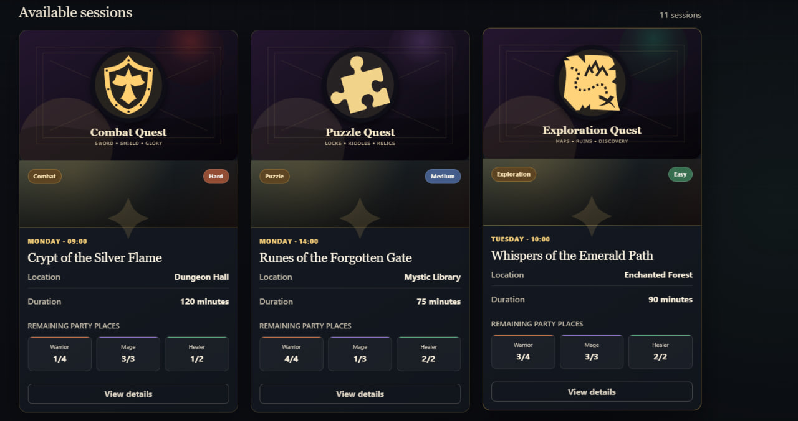

### Filtered Available Sessions

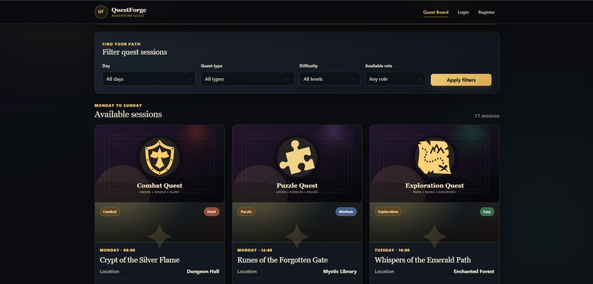

### Quest Detail Page

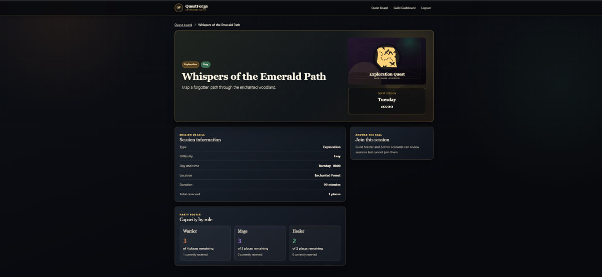

### Join Session

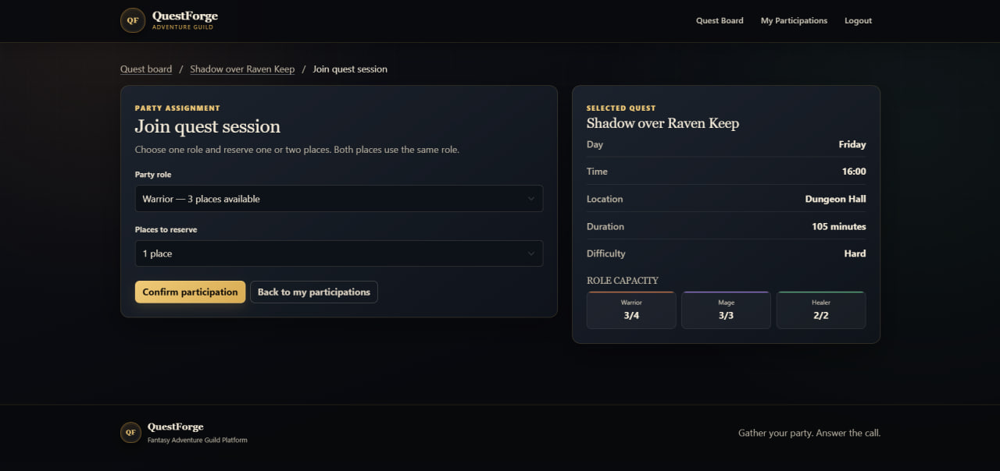

### Adventurer Profile

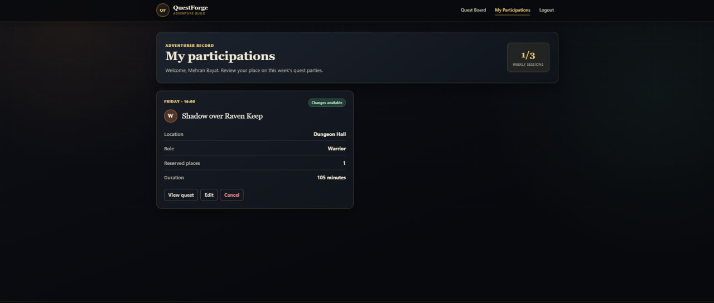

### Guild Master Dashboard

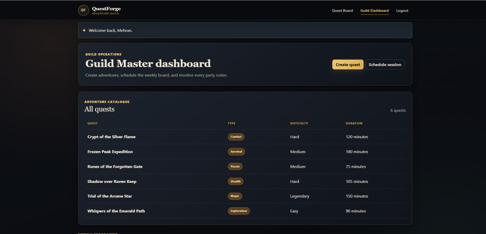

### Guild Dashboard Overview

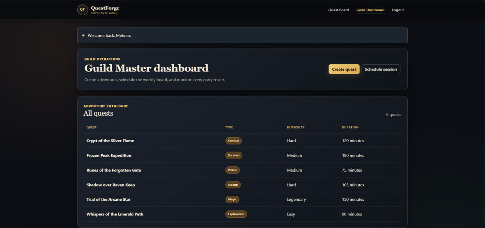

### Guild Scheduled Sessions

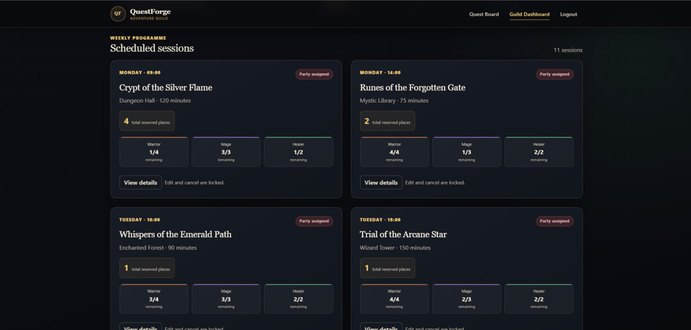

### Create Quest

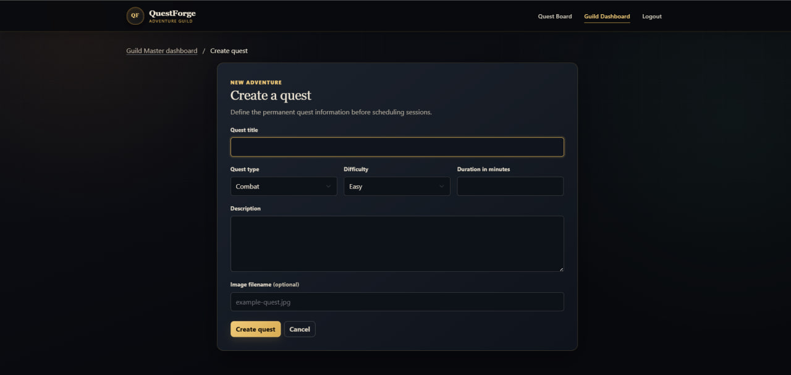

### Register Page

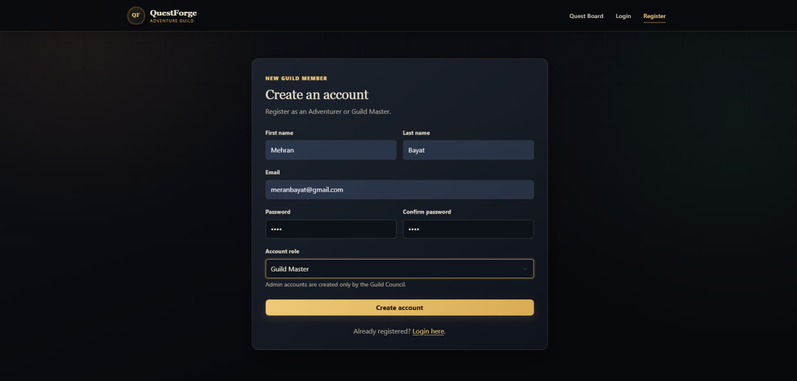

### Admin Dashboard

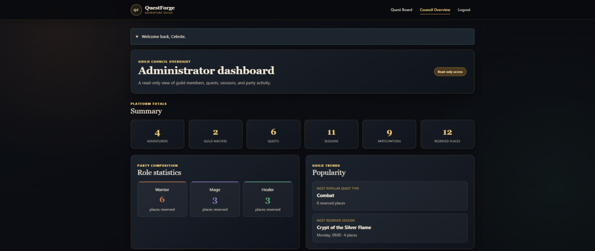

### Admin Dashboard Overview


### Admin Users and Sessions

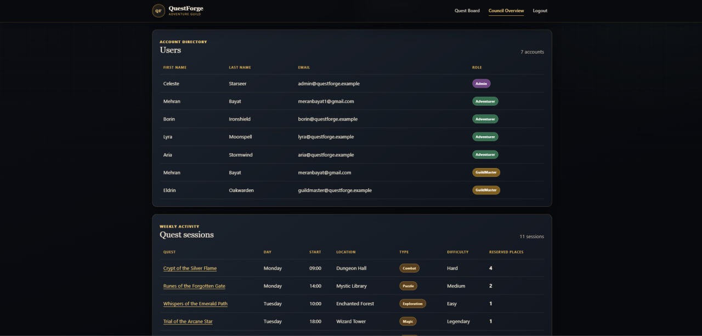

## User Flows

### Visitor

```text
Open quest board
→ Apply optional filters
→ Review session capacity
→ Open session details
→ Register or log in to participate
```

### Adventurer

```text
Log in
→ Select a session
→ Choose Warrior, Mage, or Healer
→ Reserve one or two places
→ Review weekly participations
→ Edit or cancel before the deadline
```

### Guild Master

```text
Log in
→ Create a quest
→ Schedule a day, time, and location
→ Monitor reserved and remaining places
→ Edit or cancel an empty session
```

### Guild Council Admin

```text
Log in
→ Review platform totals
→ Inspect users and sessions
→ Compare role demand
→ Review popularity statistics
```

## Validation and Security

- Passwords are stored as Werkzeug hashes, never plain text.
- Flask-Login manages authenticated sessions.
- Role-protected routes verify both authentication and the required account role.
- Registration prevents public Admin creation.
- SQL statements use parameterized queries.
- SQLite foreign-key enforcement is enabled for every connection.
- Database constraints reject invalid enum-like values and place counts.
- Capacity triggers protect inserts and updates from overbooking.
- Ownership checks prevent Adventurers from editing another user's participation.
- Mutating form submissions use POST and redirect after processing.
- Success and validation feedback uses Flask flash messages.
- Missing database records redirect safely instead of exposing internal errors.
- The secret key can be supplied through the `SECRET_KEY` environment variable.

For a production-oriented version, CSRF protection, rate limiting, stronger account provisioning, and deployment-specific security configuration should be added.

## Design Approach

QuestForge uses a dark fantasy visual language without sacrificing legibility. Deep charcoal surfaces create the guild atmosphere, while antique gold, copper, emerald, and violet accents identify actions and party roles.

The interface favors Bootstrap's responsive grid, semantic HTML, reusable Jinja inheritance, clear form labels, readable tables, keyboard focus states, and reduced-motion support. Backend modules remain deliberately direct and beginner-readable rather than introducing an ORM or a large framework architecture.

## Image Assets

QuestForge uses local fantasy-themed SVG images stored in `static/images/`. Several icon shapes are adapted from Game-icons.net under CC BY, with attribution kept in `static/images/ATTRIBUTION.md`. Optional PNG versions of the same artwork are available in `static/images/png/`, but the app primarily uses the SVG files.

## What This Project Demonstrates

- Building a modular multi-page Flask application
- Authentication and session management with Flask-Login
- Role-based authorization
- Relational modeling with standard-library SQLite
- Password hashing with Werkzeug
- Server-side form validation
- Capacity-aware reservation logic
- Weekly scheduling and overlap detection
- Simulated time-based business rules
- Jinja template inheritance and conditional navigation
- Bootstrap dashboards and responsive custom CSS
- Parameterized SQL and database integrity constraints

## What I Learned

This project reinforced how closely database design, route validation, and interface feedback depend on one another. Capacity must be calculated in places rather than records, edit operations must exclude the current reservation from availability checks, and scheduling conflicts require duration-aware interval comparisons.

It also provided practice keeping role permissions explicit, centralizing repeated time and capacity helpers, using redirect-after-POST consistently, and presenting complex reservation state through a clear themed interface.

## Future Improvements

- Add an automated test suite for role access and business-rule boundaries
- Add CSRF protection to all state-changing forms
- Introduce schema migrations instead of startup-only table creation
- Add soft cancellation and audit history
- Add configurable simulated time through an Admin-only tool
- Support multiple synthetic weeks or real calendar dates
- Add validated quest-image uploads and optimized media
- Add character avatars, experience levels, rewards, and reviews
- Add pagination for larger user and session collections
- Add password reset and email verification
- Add deployment configuration and production environment documentation

## Project Status

| Area | Status |
|---|---|
| Public quest board and filtering | Complete |
| Session detail and capacity display | Complete |
| Registration, login, and role redirects | Complete |
| Adventurer participation management | Complete |
| Weekly limit and overlap validation | Complete |
| Simulated eight-hour deadline | Complete |
| Guild Master quest/session management | Complete |
| Guild Council Admin dashboard | Complete |
| Responsive dark-fantasy interface | Complete |
| Seeded SQLite demo data | Complete |
| Automated test suite | Not included |
| Deployment configuration | Not configured |
| Screenshots | Complete |

## Author

Developed by **Mehran Bayat** as a standalone full-stack portfolio project.

## License

This project is intended for educational and portfolio purposes.
